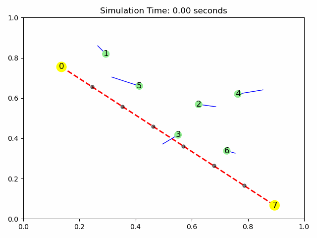

# Skoltech_Math_for_Engineers_team
Group repository for assignments and project work

**Students:**
1. Roman Voronov (Roman.Voronov@skoltech.ru), Skoltech, 2024
1. Artem Voronov (Artem.Voronov@skoltech.ru), Skoltech, 2024
1. Lev Ladanov (Lev.Ladanov@skoltech.ru), Skoltech, 2024

## Project week 1 simulation

### Description

This system can be described by the following differential equation:

$$
\dot{x} = A x
$$

where $x$ is a vector representing the positions of points in a plane, with each element $x_i = [X_i, Y_i]$ representing the coordinates of the $i$-th point.

To model the behavior in which the $i$-th agent tends to position itself at the midpoint of the segment formed by the $(i-1)$-th and $(i+1)$-th points, we define the matrix $A$ as follows:

$$
A = \frac{1}{2}
\begin{bmatrix}
0 &  0 &  0 & \cdots & 0 & 0 & 0 \\
1 & -2 &  1 & \cdots & 0 & 0 & 0 \\
0 &  1 & -2 & \cdots & 0 & 0 & 0 \\
\vdots & \vdots & \vdots & \ddots & \vdots & \vdots & \vdots \\
0 &  0 &  0 & \cdots & -2 & 1 & 0 \\
0 &  0 &  0 & \cdots & 1 & -2 & 1 \\
0 &  0 &  0 & \cdots & 0 & 0 & 0 \\
\end{bmatrix}
$$

In this matrix, the main diagonal contains the value $-2$, and the first sub-diagonal (just below the main diagonal) and first super-diagonal (just above the main diagonal) contain the value $1$. These entries enforce the rule that each agent moves towards the average position of its two immediate neighbors.

The first and last rows of the matrix $A$ consist of zeros, ensuring that the boundary points remain fixed (i.e., the first and last agents do not move).

### Properties of matrix A:
   - **Tridiagonal** (with entries \(-2\) on the main diagonal, \(1\) on the first sub and superdiagonals).
   - **Sparse** (mostly zeros).
   - **Negative definite** (all eigenvalues are negative).
   - **Real eigenvalues**.

### Finding maximum $\Delta t$:

1. System could be discretized using Euler's method:
$$x_{i+1} = x_i + \Delta t \cdot \dot{x} \Leftrightarrow \\
  x_{i+1} = x_i + \Delta t \cdot A x_i \Leftrightarrow \\
  x_{i+1} = (I + \Delta t A) x_i \Leftrightarrow \\
  x_{i+1} = Bx_i
  $$

2. The system is stable if $\forall |\lambda_i^B| < 1$.
3. New eigenvalues are given by: $\lambda_i^B = 1 + \Delta t \cdot \lambda_i^A$.
4. Since $\forall \lambda_i^A$ are negative, the system is stable as long as $1 + \Delta t \cdot \lambda_{\text{min}}^A > -1$.
5. Eigenvalues of matrix $A$ are described by the formula: $\lambda_i^A = -2 + 2\cos{\left(\frac{i\pi}{n + 1}\right)} \Rightarrow \lambda_{\text{min}}^A \geq -4$.
6. Therefore, $\Delta t \leq \frac{-2}{\lambda_{\text{min}}^A} \Rightarrow \Delta t \leq 0.5$.

Thus, $\Delta t$ should be lower than 0.5 to ensure the system's stability.

### Let's test $\Delta t$:

Simulation with $\Delta t = 0.49$:

Simulation with $\Delta t = 0.55$:

The estimation of maximum $\Delta t$ is very good.

---

## Project week 2

Now we will consider a second-order system, to control acceleration instead of velocity.

We consider models of the agents in the form of second-order integrators:

$$
\ddot{x}_i = u_i, \quad i = 0,1,2,\dots,n-1
$$

and take the control law as:

1. $u_0 = 0,$
2. $u_1 = \frac{x_2 + x_0}{2} - x_1 - \alpha \dot{x}_1,$  
3. $u_i = \frac{x_{i+1} + x_{i-1}}{2} - x_i - \alpha \dot{x}_i, \quad i = 1, \dots, n-2,$  
4. $u_{n-2} = \frac{x_{n-1} + x_{n-3}}{2} - x_{n-2} - \alpha \dot{x}_{n-2},$  
5. $u_{n-1} = 0$

### Visualization of this system:

### Description:

We can rearrange equation control law into matrix form:

$$
u = Ax - \alpha B v
$$

where:
- matrix $A$ is taken from week 1,
- vector $x$ is a position vector: $[x_0, x_1, \dots, x_{n-1}]$,
- matrix $B$ is an identity matrix with zeros on the first and last rows,
- vector $v$ is a velocity vector: $[\dot x_0, \dot x_1, \dots, \dot x_{n-1}]$.

We can simulate the system using Euler's method by updating the state at each step:

$$
v_{k+1} = v_k + \Delta t \cdot u_k(x_k, v_k) 
$$

$$
x_{k+1} = x_k + \Delta t \cdot v_k
$$

---

# Added Van Loan schemes

## Ellipse

**System:**

$$
x_{i+1} = \frac{Mx_i}{|Mx_i|}, \quad x_{i+1} = x_{i+1} - \text{mean}(x_{i+1})
$$

$$
M = \frac{1}{2}
\begin{bmatrix}
1 & 1 &  &  &  \\
  & 1 & 1  &  &  \\
  &   & \ddots & \ddots  &  \\
  &   &   & 1 & 1 \\
1 &   &   &   & 1
\end{bmatrix}
$$

## Segment

**System:**

$$
x_{i+1} = Mx_i + \alpha \omega
$$

$$
M =
\begin{bmatrix}
1   & 0   &   &   &   \\
0.5 & 0   & 0.5  &   &   \\
    & \ddots & \ddots & \ddots  &   \\
    &   & 0.5 & 0 & 0.5 \\
    &   &    & 0 & 1
\end{bmatrix}
$$

$$
\alpha \text{ - movements speed }\frac{rad}{s}
$$

## Circle

**System:**

$$
\theta_{i+1} = M\theta_i \\
\begin{bmatrix}
x_i \\
y_i
\end{bmatrix} = 
R * \begin{bmatrix}
\cos(\theta_i) \\
\sin(\theta_i)
\end{bmatrix}
$$

$$
M =
\begin{bmatrix}
1   & 0   &   &   &   \\
0.5 & 0   & 0.5  &   &   \\
    & \ddots & \ddots & \ddots  &   \\
    &   & 0.5 & 0 & 0.5 \\
    &   &    & 0 & 1
\end{bmatrix}
$$

**Initial State:** $\theta$ for first and last point should be fixed at point $0$ and $2\pi$

